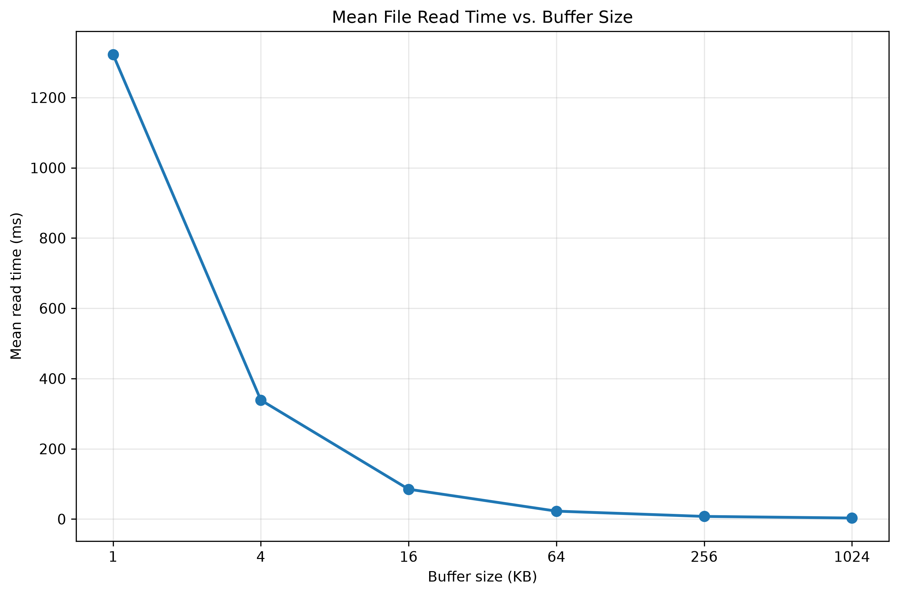
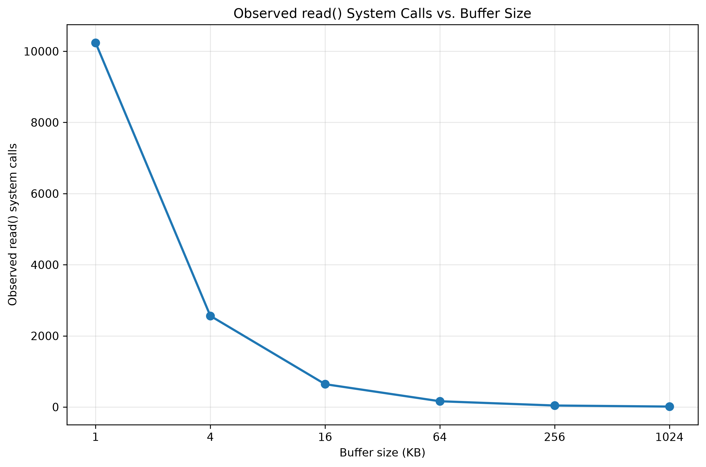
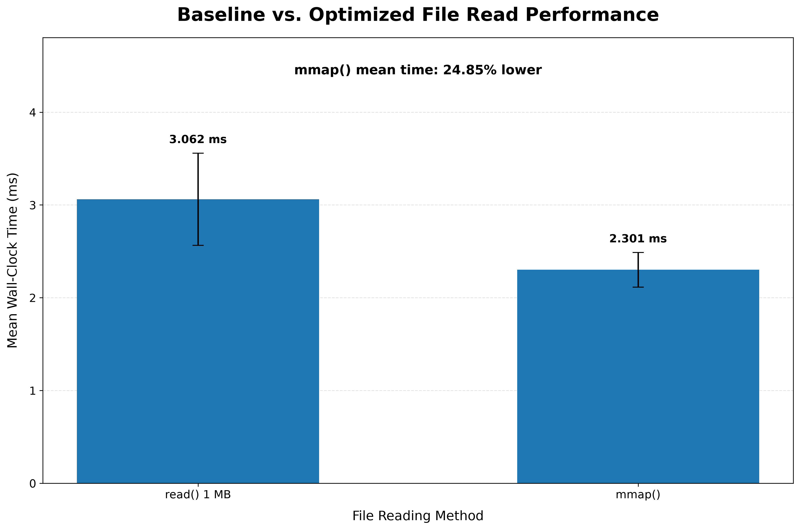
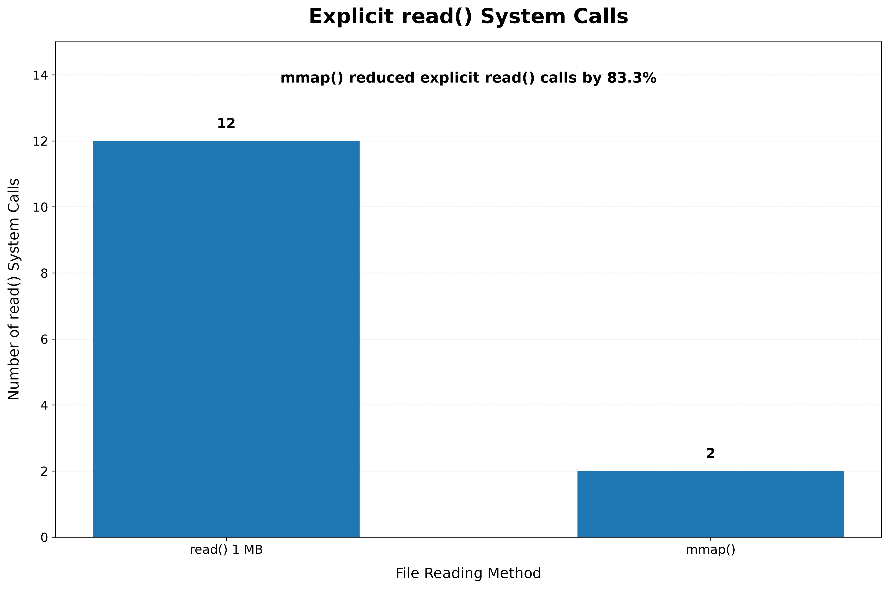

<div align="center">

# ⚙️ System Call Performance Optimizer 

### Measuring Linux file I/O. Optimizing the access path. Proving the result.

<br>

**`read()` → `mmap()`**

<br>

[](https://en.wikipedia.org/wiki/C_(programming_language))
[](https://gcc.gnu.org/)
[](https://www.python.org/)
[](https://www.linux.org/)
[](https://strace.io/)

<br><br>

<p>
<a href="#demo-video"></a>
<a href="#quick-start"></a>
<a href="#methodology"></a>
<a href="#results"></a>
</p>

<p>
<a href="#implementation"></a>
<a href="#project-structure"></a>
</p>

</div>

---

<a id="demo-video"></a>
## 🎬 Demo Video

<div align="center">

<a href="https://www.youtube.com/watch?v=lZCsafPlsx8">
  
</a>
<br>

*A short walkthrough of the benchmark methodology, implementation, and results.*
</div>

---

<a id="methodology"></a>
## 🔬 Methodology

```text
┏━━━━━━━━━━━━━━━━━━━━━━━━━━━━━━━━━━━━━━━━━━━━━━━━━━━━┓
┃                                                    ┃
┃  WORKLOAD                                          ┃
┃  └─ 10 MiB binary file                             ┃
┃                                                    ┃
┃  BASELINE                                          ┃
┃  └─ read() with six buffer sizes                   ┃
┃                                                    ┃
┃  MEASUREMENT                                       ┃
┃  └─ 3 warm-up + 20 recorded iterations             ┃
┃                                                    ┃
┃  OPTIMIZATION                                      ┃
┃  └─ mmap()-based file access                       ┃
┃                                                    ┃
┃  EVALUATION                                        ┃
┃  └─ Timing + CPU time + page faults + strace       ┃
┃                                                    ┃
┗━━━━━━━━━━━━━━━━━━━━━━━━━━━━━━━━━━━━━━━━━━━━━━━━━━━━┛
```

### Experimental Flow

```text
10 MiB workload
      │
      ▼
┌───────────────┐
│ read()        │
│ baseline      │
└───────┬───────┘
        │
        ▼
  1 KB → 1 MB
  buffer study
        │
        ▼
   1 MB baseline
        │
        ▼
┌───────────────┐
│ mmap()        │
│ optimization  │
└───────┬───────┘
        │
        ▼
 Performance + syscall
       analysis
```

<a id="results"></a>
## 📊 Results

The optimization produced a measurable improvement.

| Metric | read() 1 MB | mmap() | Improvement |
|---|---|---|---|
| Mean execution time | 3.062 ms | 2.301 ms | 24.85% lower |
| Median execution time | 2.904 ms | 2.255 ms | 22.33% lower |
| Standard deviation | 0.497 ms | 0.187 ms | 62.36% lower |
| Explicit read() calls | 12 | 2 | 83.33% fewer |
| Measurement runs | 20 | 20 | Same sample count |

> **Key result:** Under the conditions of this experiment, `mmap()` reduced mean wall-clock execution time by **24.85%** compared with the 1 MB `read()` baseline.

<div align="center">

<table>
<tr>
<td width="50%" align="center">

**01 / Baseline Performance**
<br>

<br>
<sub>Increasing buffer size reduced execution time; 1 MB was selected as baseline.</sub>

</td>
<td width="50%" align="center">

**02 / System-Call Behavior**
<br>

<br>
<sub>Larger buffers required fewer explicit read() calls (12 at 1 MB).</sub>

</td>
</tr>
<tr>
<td width="50%" align="center">

**03 / Baseline vs. Optimized**
<br>

<br>
<sub>mmap() cut mean execution time from 3.062 ms to 2.301 ms.</sub>

</td>
<td width="50%" align="center">

**04 / System-Call Comparison**
<br>

<br>
<sub>read() calls dropped from 12 to 2 — an 83.33% reduction.</sub>

</td>
</tr>
</table>

</div>

<br>

<div align="center">

```text
┏━━━━━━━━━━━━━━━━━━━━━━━━━━━━━━━━━━━━━━━━━━━━━━━━━━━━┓
┃                                                    ┃
┃              FINAL OBSERVATION                     ┃
┃                                                    ┃
┃           3.062 ms  →  2.301 ms                    ┃
┃                                                    ┃
┃                  ↓ 24.85%                          ┃
┃                                                    ┃
┃         mean execution time reduction              ┃
┃                                                    ┃
┗━━━━━━━━━━━━━━━━━━━━━━━━━━━━━━━━━━━━━━━━━━━━━━━━━━━━┛
```

</div>

<a id="implementation"></a>
## ⚙️ Implementation

### Baseline — `read()`

The baseline implementation processes the 10 MiB test file through repeated `read()` system calls using a configurable user-space buffer.

```text
File
 │
 ▼
┌──────────────┐
│    read()    │
└──────┬───────┘
       ▼
    Buffer
       │
       ▼
   Process data
       │
       └──────→ read() → Buffer → ...
```

Six buffer sizes were evaluated:

**1 KB → 4 KB → 16 KB → 64 KB → 256 KB → 1 MB**

The 1 MB configuration was selected as the final baseline.

### Optimized — `mmap()`

The optimized implementation maps the complete test file into the process's address space.

```text
File
 │
 ▼
┌──────────────┐
│    mmap()    │
└──────┬───────┘
       ▼
Memory-mapped region
       │
       ▼
Access file contents
       │
       ▼
┌──────────────┐
│   munmap()   │
└──────────────┘
```

The mapped region is accessed across the complete 10 MiB workload before the mapping is released.

<a id="quick-start"></a>
## ⚡ Quick Start

### Build

```bash
gcc -Wall -Wextra -O2 -std=c99 -D_GNU_SOURCE \
    src/file_read_baseline.c src/benchmark_utils.c \
    -o file_read_baseline -lm

gcc -Wall -Wextra -O2 -std=c99 -D_GNU_SOURCE \
    src/file_read_optimized.c src/benchmark_utils.c \
    -o file_read_optimized -lm
```

### Run

```bash
./file_read_baseline
./file_read_optimized
```

### Analyze

```bash
python3 scripts/compare_baseline_optimized.py
python3 scripts/compare_syscalls.py
```

<a id="project-structure"></a>
## 📁 Project Structure

```text
system-call-optimizer/
├── src/          # C implementations and benchmark utilities
├── scripts/      # Analysis and visualization
├── test_files/   # 10 MiB benchmark workload
├── results/      # Experimental data and statistics
├── report/       # Generated performance figures
└── README.md
```

`src` builds it. `scripts` measures it. `results` records it. `report` presents it.
